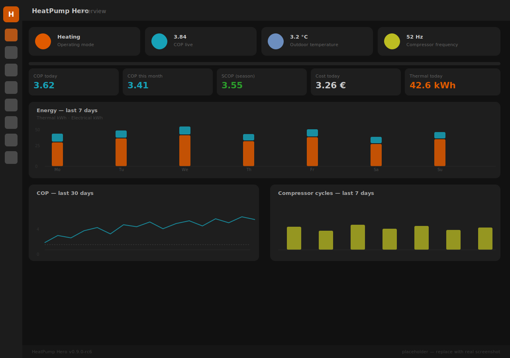

# HeatPump Hero

> Universal Home Assistant package for Panasonic Aquarea heat pumps with
> Heishamon — dashboard, statistics, optimization advisor, control automations.

[](https://github.com/st03psn/heat-pump-hero/actions/workflows/validate.yml)
[](https://github.com/hacs/integration)
[](LICENSE)

HeatPump Hero bundles what's missing today: an importable Home Assistant dashboard
laid out like the Heishamon web UI, Service-Cloud-style analytical graphs, an
installation schematic with live hotspots, and proper efficiency metrics
(SCOP / monthly / daily / live COP) — including multi-year tracking.

## Status

🟢 **v0.7.2 — beta** — multi-platform read-only bridge: republishes
~50 derived sensors (COP / SCOP / advisor / diagnostics) onto MQTT so
ioBroker / openHAB / Node-RED can subscribe. v0.7 still current for
control extensions (adaptive heating curve, price-driven DHW,
weather-forecast pre-heating). See [CHANGELOG.md](CHANGELOG.md).

## Screenshots



*(screenshot is a placeholder; will be replaced with a real PNG once a
reference install is online — see [docs/screenshots/](docs/screenshots/).)*

## Features

**Diagnostics & vendor support** _(new in v0.4)_
- ✅ Panasonic fault-code analysis: 30+ H/F codes mapped to plain-language
  descriptions and severity, with model-specific commentary (J-series H23,
  R32/R290 H99, J/K H62 false alarms)
- ✅ Recurrence detection (same code N× in 5-event ring buffer)
- ✅ Persistent notification on fault, dismissed automatically when cleared
- ✅ Vendor preset selector — auto-fills all 17 source helpers in one
  click for Heishamon / Daikin / MELCloud / Vaillant / Stiebel / generic
- ✅ Heat-pump model selector — Panasonic J / K / L / T-CAP / **M (R290)**
  plus other vendors — auto-sets compressor min/max Hz, minimum flow,
  maximum supply temperature
- ✅ Water-pressure trend advisor (slow-leak detection)

**Visualization**
- ✅ 7-view dashboard: Overview, Schematic, Analysis, Efficiency,
  Optimization, Mobile, Configuration
- ✅ **Bubble-Card SVG schematic** with live hotspots — 4 variants:
  HK1, HK1+DHW, HK1+HK2+DHW, HK1+HK2+DHW+Buffer
- ✅ ApexCharts: temperatures, compressor, COP, heatmap (day-of-week ×
  hour), outdoor-T° vs COP scatter
- ✅ **Mobile view** — single-column layout for phones
- ✅ Heishamon-web-UI-style overview with Mushroom cards

**Counters & efficiency**
- ✅ Live COP (defrost-masked), daily / monthly / yearly COP, SCOP
- ✅ **Tariff splits** in utility_meter (heating / DHW / cooling separate)
- ✅ Period comparisons: vs last month / vs last year, in % with
  trend headlines
- ✅ HA Energy Dashboard integration via `*_active` energy sensors

**Source-adapter (universal)**
- ✅ Every entity-ID is UI-configurable — swap heat pump or meter
  without YAML edits
- ✅ 3 thermal source modes: `calculated` / `external_power` /
  `external_energy` (kWh meter bypasses integration)
- ✅ 3 electrical source modes: `heat_pump_internal` / `external_power` /
  `external_energy`
- ✅ Defaults match Heishamon out of the box; zone 2 / DHW / buffer /
  solar / pool optional with auto-hide

**Cycle analysis & advisor**
- ✅ Cycle tracking (starts/h, run/pause times)
- ✅ Short-cycle detection with configurable threshold
- ✅ **Auto-detected heating limit** (rolling smoothed avg of outdoor
  temp at end of compressor runs ≥ 30 min)
- ✅ Data-driven **advisor** with plain-language recommendations:
  cycling, supply/return spread, defrost, heat curve / aux heater,
  DHW run length, heating limit — aggregate traffic-light tile

**Control strategies (HeishaMoNR parity)**
- ✅ CCC (Compressor Cycle Control), SoftStart, Solar-DHW boost,
  night Quiet-Mode — all individually toggleable, master switch
  required, default off

**Multi-platform bridge** _(new in v0.7.2)_
- ✅ Republishes ~50 derived sensors (COP / SCOP / advisor /
  diagnostics) onto MQTT for ioBroker / openHAB / Node-RED / secondary
  HA — read-only, hardware-abstracted, retain + auto-clear-on-disable.
  See [docs/multivendor_bridge.md](docs/multivendor_bridge.md)

**Long-term, export, import**
- ✅ Grafana boards: overview + multi-year SCOP / MAZ (real Flux queries)
- ✅ Telegraf MQTT → InfluxDB bridge config
- ✅ Export module — CSV / JSON / XLSX, manual or scheduled
- ✅ Import module — backfill HA long-term stats from CSV (e.g. legacy
  Shelly / utility-cloud history before HeatPump Hero was installed)
- ✅ Database guidance — SQLite vs MariaDB vs PostgreSQL vs InfluxDB
- ✅ Setup blueprint and CLI installer

## Requirements

- Home Assistant 2025.4 or newer
- Heishamon hardware (Egyras / IgorYbema firmware) connected to an MQTT
  broker (default topic prefix: `panasonic_heat_pump`)
- HACS installed

## Quick install (HACS, recommended — v0.9+)

1. **Install dependencies in HACS** (frontend plugins, order doesn't matter):
   apexcharts-card, bubble-card, mushroom, button-card,
   auto-entities, card-mod. Plus the kamaradclimber Heishamon-HomeAssistant
   integration (or your vendor equivalent).

2. **Add HeatPump Hero as a HACS custom repository**
   - HACS → ⋮ → Custom repositories
   - URL: `https://github.com/st03psn/heat-pump-hero`
   - Category: **Integration**
   - Install, restart HA.

3. **Add the integration**
   - Settings → Devices & Services → Add Integration → search "HeatPump
     Hero" → run the 4-step wizard (vendor preset, pump model, optional
     external sensors, confirm).
   - Restart HA when prompted. The dashboard appears in the sidebar
     automatically.

4. **(Optional) External sensors** — open the integration's Configure
   button or the dashboard's Configuration view to point HeatPump Hero
   at a Shelly / heat meter / indoor reference thermometer.

To remove HeatPump Hero, simply delete the integration in **Settings →
Devices & Services**: the integration cleans up every file it deployed.
Recorder history of `sensor.hph_*` is preserved.

### Manual / script-based install (legacy)

Pre-v0.9 deployments and Windows users without HACS can still use
`scripts/install.sh` (Linux) or `scripts/update.ps1` (Windows). See
[docs/installation.md](docs/installation.md) and
[docs/installation_windows.md](docs/installation_windows.md).

## Architecture

```
  Heishamon ─┐
             ├─MQTT─▶ kamaradclimber → HA entities
  Shelly ────┤                        │
  Heat meter ┘                        ├─▶ hph packages (templates)
                                      │     ├─ COP / SCOP / monthly / daily
                                      │     └─ thermal/electrical energy
                                      ├─▶ HA Recorder + LTS ─▶ Lovelace
                                      └─▶ HA Energy Dashboard
                                      ↓
                                 InfluxDB ─▶ Grafana (multi-year SCOP)
```

## Project name

**HeatPump Hero** — a hub for everything around Heishamon: dashboard + control +
statistics in a single bundle.

## Contributing

Issues and pull requests welcome.

- [CLAUDE.md](CLAUDE.md) — architecture and conventions
- [docs/installation.md](docs/installation.md) — step-by-step setup
- [docs/external_sensors.md](docs/external_sensors.md) — Shelly / heat meter
- [docs/optimization.md](docs/optimization.md) — cycle analysis, advisor, control
- [docs/tweaking.md](docs/tweaking.md) — power-user customizations
- [docs/multivendor_bridge.md](docs/multivendor_bridge.md) — MQTT bridge for ioBroker / openHAB / Node-RED
- [docs/roadmap.md](docs/roadmap.md) — what's next

English-only until v1.0 (see [CONTRIBUTING.md](CONTRIBUTING.md)).

## License

MIT — see [LICENSE](LICENSE).

## Related projects

- [Egyras/HeishaMon](https://github.com/Egyras/HeishaMon) — firmware
- [kamaradclimber/heishamon-homeassistant](https://github.com/kamaradclimber/heishamon-homeassistant) — HA integration (required dependency)
- [edterbak/HeishaMoNR](https://github.com/edterbak/HeishaMoNR) — Node-Red variant (can run in parallel)
