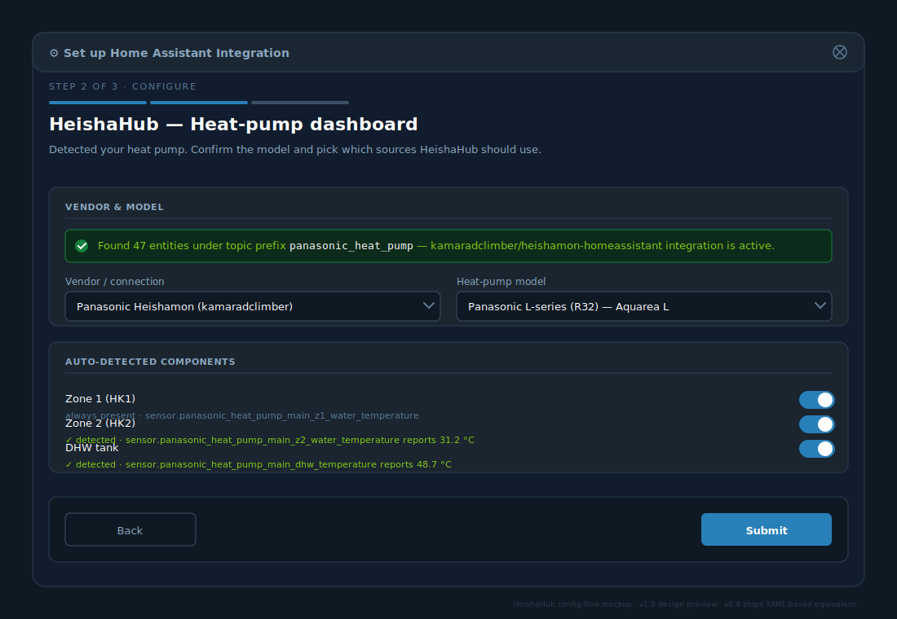
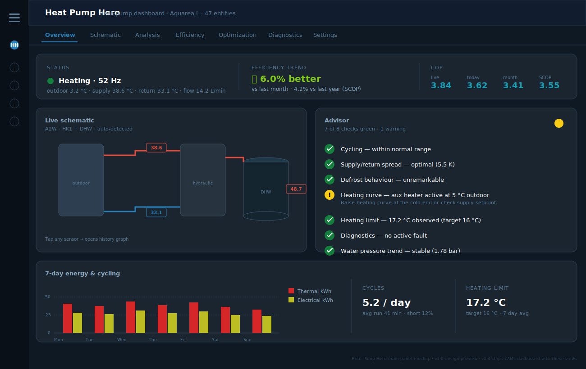

# HeatPump Hero — integration UI mockup (v1.0 design preview)

This document shows what HeatPump Hero's UI will look like once it becomes a
proper Python custom integration (planned for v0.6 → v1.0). The current
v0.4 release ships YAML-based equivalents of every screen below.

## Why mockup first?

Building a custom integration is a 6-8 day refactor (see
[hacs_path.md](hacs_path.md)). The mockup serves three purposes:

1. **Spec the UX** before writing Python — what config flow steps,
   what main panel shape, what settings are needed.
2. **Sanity-check feature parity** — every YAML feature in v0.4 must have
   a counterpart in the integration, or we lose function in the move.
3. **Communicate to contributors** what we're building toward.

## Setup wizard (config flow)

Three steps:

1. **Choose vendor** — auto-detect Heishamon by probing for entities
   with prefix `panasonic_heat_pump`. Fall through to a vendor dropdown
   (Daikin Altherma / MELCloud / Vaillant / Stiebel / generic MQTT /
   generic Modbus) if not found.

2. **Confirm model + components** — the screen shown in the mockup.
   Vendor and model dropdowns; auto-detected components (HK1, HK2, DHW,
   buffer) shown with the entities they came from. Each can be toggled
   off explicitly if the user wants HeatPump Hero to ignore it.

3. **Wire up extras** — optional Shelly / heat-meter / utility-meter
   entities; tariff splits; control automation toggle (CCC, SoftStart,
   Solar-DHW, night Quiet-Mode); language preference (defaults to
   `hass.config.language`, falls back to English).

The final "Submit" registers the integration: helpers, sensors,
automations, and dashboard views are all created programmatically.

## Main panel

The integration shows up as a **side-bar panel** with seven internal
tabs (the same information architecture as the YAML dashboard today):

| Tab | What it shows |
|---|---|
| **Overview** | hero status strip + live schematic preview + advisor + 7-day energy bars (mockup above) |
| **Schematic** | full-size Bubble-Card SVG with hotspots (auto-detected variant) |
| **Analysis** | ApexCharts: temperatures, compressor, COP heatmap, outdoor-T° vs COP scatter |
| **Efficiency** | period KPIs, comparisons (vs last month / last year), tariff splits, 30-day bar chart |
| **Optimization** | cycle stats, advisor results with messages, control switches |
| **Diagnostics** (new in mockup) | active fault, fault history (last 5), full Panasonic code reference |
| **Settings** | vendor preset, model, source-helper editor, language, theme |

## Settings panel detail

The settings tab is what today's *Configuration* view becomes — but
fully UI-driven (no entity-ID typing if the vendor preset matches your
install). Sections:

1. **Vendor & model** — preset (auto-fill) + model with auto thresholds
2. **Sources** — source-mode selectors and (if needed) entity-ID overrides
3. **Optional components** — toggles for HK2 / DHW / buffer with
   detected-state confirmation
4. **External meters** — Shelly / heat meter / utility meter
5. **Diagnostics** — error-code source override + historic event log
6. **Control** — master switch + per-strategy toggles, with thresholds
7. **Advanced** — advisor thresholds (heating-limit target, short-cycle
   warn/crit %, target ΔT, DHW min runtime)

## What's new in v0.4 already (YAML)

Everything the mockup shows ships now — just not yet behind a config flow.
Feature parity:

| Mockup element | v0.4 equivalent |
|---|---|
| Vendor preset dropdown with auto-fill | `input_select.hph_vendor_preset` + automation |
| Model dropdown with auto thresholds | `input_select.hph_pump_model` + automation |
| Auto-detected components | `binary_sensor.hph_has_hk2/dhw/buffer` |
| Active fault + history | `sensor.hph_diagnostics_current_error` + ring buffer |
| 8-rule advisor with traffic-light | `sensor.hph_advisor_*` (8 advisors) |
| 7 dashboard views | `dashboards/hph.yaml` (overview/schema/analysis/efficiency/optimization/mobile/config) |
| Mobile view | `- title: Mobile` view |

The integration just makes all of this clickable and hides the
underlying YAML.

## Translations

When the integration ships, `translations/{en,de,nl}.json` will follow
HA's `hass.config.language` automatically — English fallback. Today's
v0.4 dashboard has English UI strings only, but README/docs/info are
already translated to DE and NL.
